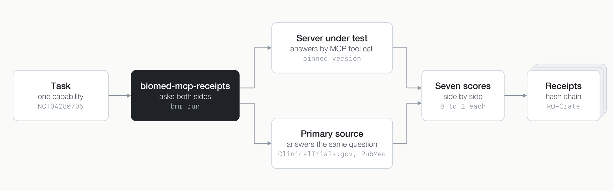
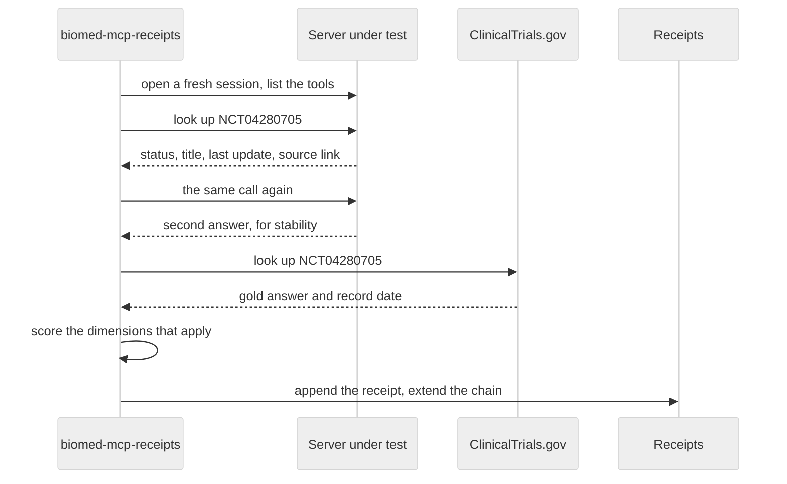
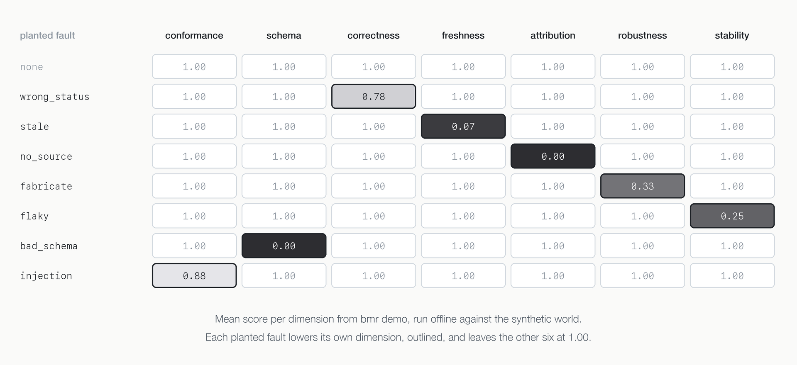
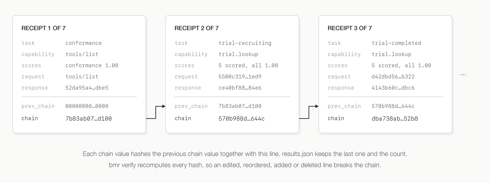
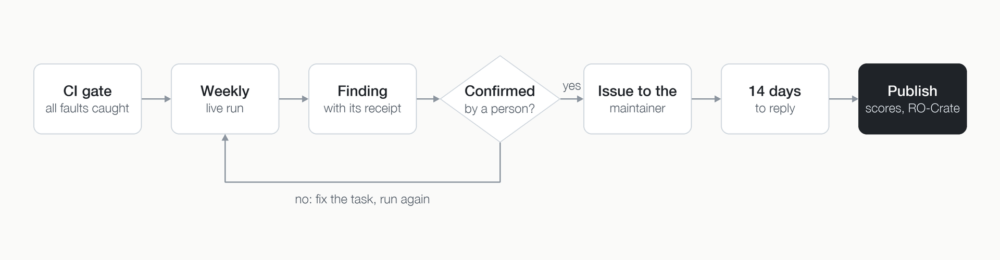

# biomed-mcp-receipts

**Receipts for biomedical MCP tools.**

[](https://github.com/a7med7emedan/biomed-mcp-receipts/actions/workflows/tests.yml)
[](https://github.com/a7med7emedan/biomed-mcp-receipts/actions/workflows/docker.yml)
[](LICENSE)
[](https://www.python.org/)

AI agents now reach PubMed, ClinicalTrials.gov and other biomedical sources through MCP servers.
When a server returns a wrong trial status or a stale record, the agent repeats it with confidence.
Agent benchmarks score the agent, and the official conformance suite checks the protocol. Neither
checks the data.

biomed-mcp-receipts checks the data. It calls each server's tools directly and asks the primary source
the same question in the same run. It scores the two answers on seven dimensions, and every check
leaves a hash-chained receipt that anyone can verify later.

Try it in one minute. The self-test runs offline, needs only [uv](https://docs.astral.sh/uv/), and
shows every planted fault being caught:

```bash
uvx --from git+https://github.com/a7med7emedan/biomed-mcp-receipts bmr demo
```

## Who it is for

- **MCP server maintainers.** Run it before a release to see your server's answers next to the
  source's. Adding your server takes one adapter function.
- **Agent and app builders.** Choose between biomedical servers on evidence rather than on a README.
- **Reviewers, auditors and governance teams.** Check a published score yourself. `bmr verify`
  needs only the run folder, not trust in whoever ran it.

## What you get

- **Evidence behind every score.** Each score points to a receipt holding the request, the server's
  response, the source's answer and the hashes of all three.
- **A tamper-evident audit trail.** Receipts form a hash chain. `bmr verify` detects any line that
  was edited, reordered, added or removed.
- **Reruns on the same evidence.** Record mode saves every source response, so a run can be replayed
  offline and give the same scores.
- **Pinned servers.** Each server runs at an exact version, and CI fails when its tool list drifts
  from the recorded snapshot.
- **Injection screening.** Tool descriptions are checked for text that tries to instruct the model.
- **A tool that tests itself.** Seven planted faults must each trip their own dimension, or CI fails.
- **Standard provenance.** Each run is written as an RO-Crate that WorkflowHub can read and Zenodo
  can archive.

No language model runs inside the tool. Its verdicts come from the source, the scorers and the
hashes, so a reviewer can check every one of them.

## How it works



1. A task is written once against a capability, such as trial lookup or literature search.
2. A small adapter turns the task into that server's own tool name and arguments.
3. The tool calls the server under test, and an oracle asks the primary source directly.
4. The scorers compare the two answers on each dimension that applies.
5. The check is written as a receipt and appended to the run's hash chain.

### One check, step by step



Every check runs in its own session, so a call that hangs or crashes the server cannot affect the
next one. The gold answer is fetched once per task per run, so every server in a run is scored
against the same evidence.

### Three design choices

1. **Tasks are written once, against a capability.** Adding a server means one adapter function,
   not new tasks.
2. **Gold answers are live.** The oracle records the source's release or timestamp with each
   answer. The tool never goes stale, and it can measure how far a server lags behind its source.
3. **The tool proves itself.** It ships a deliberately broken MCP server with seven planted
   faults. Every fault must trip its own dimension and no other.

## The seven dimensions

Scores run from 0 to 1 and are reported side by side, never added into one number. A server can be
correct and stale, or fresh and unsourced, and the reader should see which.

| Dimension | Question | How it is measured |
| --- | --- | --- |
| Conformance | Does the server follow the MCP spec? | Server identity, tool descriptions, tool names, valid JSON Schema 2020-12 input and output schemas, deterministic `tools/list`, no instruction-injection text in descriptions |
| Schema | Do outputs match the declared schemas? | `structuredContent` validated against the tool's `outputSchema` |
| Correctness | Is the answer right? | Trials: ID, overall status and title against ClinicalTrials.gov. Literature: share of returned PubMed IDs that the source also returns for the same query and window |
| Freshness | How far behind the source is it? | Trials: last-update date against the source, in days. Literature: share of the source's five newest records returned |
| Attribution | Does it say where the data came from? | Source named, and links to the individual records |
| Robustness | Does it fail honestly? | Unknown IDs, malformed IDs and nonsense queries must give a clean error or nothing, never an invented record |
| Stability | Same question, same answer? | Two identical calls compared; latency p50 and p95 recorded |

A dimension that does not apply to a check is left unscored, shown as `–`, rather than counted as a
pass or a fail. A lookup that returns an error instead of an answer scores 0 on correctness, and
the summary lists every such call so an outage is not mistaken for wrong data. On the robustness
tasks, an error counts as the right answer only when it is about the input, such as an unknown or
malformed ID. An error from the server's own upstream source is left unscored.

## Quick start

```bash
uv tool install git+https://github.com/a7med7emedan/biomed-mcp-receipts   # PyPI from the first tag

bmr demo                            # the self-test: every planted fault caught, offline
bmr servers                         # the pinned servers under test
bmr run -s clinicaltrials           # one server against the live ClinicalTrials.gov API
bmr run --oracle record              # all servers, saving the evidence in the run folder
bmr verify runs/<run-id>            # recompute every receipt hash, the chain and its length
bmr run --oracle replay --cassettes runs/<run-id>/cassettes   # rerun offline on the same evidence
```

The npm-based servers need Node 24 and `npx`; BioMCP needs `uv tool install biomcp-cli==0.9.1`.
Or skip all of that and use Docker, which has every pinned server inside:

```bash
mkdir -p runs && chmod 777 runs     # Linux only: the container user is uid 10001
docker compose run --rm demo
NCBI_API_KEY=... docker compose run --rm bench
```

An [NCBI API key](https://www.ncbi.nlm.nih.gov/account/settings/) is optional. With it the PubMed
oracle may send 10 requests a second instead of 3.

### What the self-test prints

```
planted fault  should trip   tripped
none           (nothing)     (nothing)  ok
wrong_status   correctness   correctness  ok
stale          freshness     freshness  ok
no_source      attribution   attribution  ok
fabricate      robustness    robustness  ok
flaky          stability     stability  ok
bad_schema     schema        schema  ok
injection      conformance   conformance  ok
Every planted fault was caught by its own dimension, and only that one.
```



The planted server and the replay cassettes are built from the same synthetic world
([`world.json`](src/biomed_mcp_receipts/data/world.json)), so the fault-free server must score 1.0
everywhere. Its trial IDs (`NCT9…`) and PubMed IDs (`99…`) lie outside today's real ranges on purpose.

## Use it in a pipeline

Every command is a plain CLI call with a meaningful exit code, so it fits any CI system or workflow
engine. `bmr demo` exits 1 if a planted fault slips through. `bmr verify` exits 1 if a receipt or the
chain was altered. `bmr report --json` prints the scores for your own gate.

A GitHub Actions job that checks a server and fails the build when correctness drops:

```yaml
jobs:
  receipts:
    runs-on: ubuntu-latest
    steps:
      - uses: astral-sh/setup-uv@v7
      - uses: actions/setup-node@v7
        with:
          node-version: "24"
      - run: uv tool install git+https://github.com/a7med7emedan/biomed-mcp-receipts
      - run: bmr demo --out selftest                     # the tool proves itself first
      - run: bmr run -s clinicaltrials --oracle record --out runs
      - name: verify the receipts and gate on correctness
        run: |
          for d in runs/*/; do
            bmr verify "$d"
            bmr report "$d" --json | jq -e '[.servers[].dimensions.correctness.mean] | min >= 0.9'
          done
      - uses: actions/upload-artifact@v7
        with:
          name: receipts
          path: runs/
```

The same three steps work in GitLab CI, Jenkins, Snakemake or Nextflow, and the Docker image runs
them with every pinned server already inside. Each run folder is an RO-Crate, so it can be
registered in WorkflowHub or archived on Zenodo as it is. To check a server that is not yet pinned,
add its adapter in a fork, as described in [Adding a server](#adding-a-server).

## Receipts

Every check writes one line to `receipts.jsonl`. The line holds the full request and response
with their SHA-256 hashes, and the oracle's URL, release and response hash. It also holds the
scores, the server's exact version and its tool-list hash. Each line's `chain` value hashes the
previous line's chain together with this line. The run records the final chain value and the
receipt count in `results.json`.
`bmr verify` recomputes all of it, so editing, reordering, adding or deleting any line is detected.



Each run is also described as an [RO-Crate](https://www.researchobject.org/ro-crate/) following the
[Process Run Crate](https://www.researchobject.org/workflow-run-crate/profiles/process_run_crate/)
profile: each check is a `CreateAction` whose `instrument` is the server under test. That makes a
run something WorkflowHub can read and Zenodo can archive with a DOI.

## Servers in the first wave

| Server | Pinned version | Capabilities | Licence |
| --- | --- | --- | --- |
| [genomoncology/biomcp](https://github.com/genomoncology/biomcp) | biomcp-cli 0.9.1 | trial lookup, literature search | MIT |
| [cyanheads/pubmed-mcp-server](https://github.com/cyanheads/pubmed-mcp-server) | 2.10.20 | literature search | Apache-2.0 |
| [cyanheads/clinicaltrialsgov-mcp-server](https://github.com/cyanheads/clinicaltrialsgov-mcp-server) | 2.9.11 | trial lookup | Apache-2.0 |

Every adapter call is checked in CI against the server's own `inputSchema`, captured from its
`tools/list` at the pinned version. A separate CI job re-reads each live server's tools and fails if
they drift from the snapshot.

## How results are published



Scores for third-party servers are shared privately with each maintainer, with 14 days to respond,
before they are published. The weekly workflow keeps its runs as private artifacts for that reason.

## Limits worth knowing

- Version 0.1 covers two capabilities: trial lookup and literature search.
- Literature correctness compares against PubMed's own search. A server built on a different index,
  such as Europe PMC or PubTator, can return valid records that PubMed's search does not. A low
  score there means "server and source disagree", not "server wrong". The score's note names up to five
  disputed IDs, and the receipt keeps the full response for the rest.
- Answers are read from structured content first, then JSON inside text, then prose. In prose, a
  trial status is read only right after a label such as "Overall status:". A server that words it
  differently is under-read rather than misread, and the receipt keeps the full response.
- Freshness is only scored where a server states a date. Not stating one is reported, not penalised.

## Adding a server

The first wave covers three servers. Yours can be next. See
[docs/adding-a-server.md](docs/adding-a-server.md). In short: pin it in
[`servers.yaml`](src/biomed_mcp_receipts/data/servers.yaml), write one adapter function, snapshot its
tools with `python scripts/snapshot_tools.py`, and run the tests.

## Citing

See [CITATION.cff](CITATION.cff). Each tagged release is archived on Zenodo with a DOI.

## Contact

Bug reports, questions and security reports go in the
[issue tracker](https://github.com/a7med7emedan/biomed-mcp-receipts/issues). For anything else, email
Ahmed Hemedan at ahmed.hemedan@lih.lu.

## Licence

[Apache-2.0](LICENSE).
